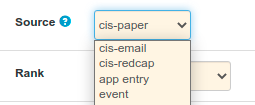

# General Selections / Drop-Downs

## Introduction

**General Selections** are used to represent entry fields where a user has one or more choices. Typically this is represented as a drop-down selection field or
a multiple-selection box / tag list.

A set of General Selection entries are related to a single field in a specific database table. All available field / table combinations are predefined, making it easier to accurately configure new entries. Each General Selection entry represents a single choice, tying together the label selected by a user and the associated value to be stored to the database.

Administration is provided in [Classification: General Selections](/admin/general_selections)

## Adding an Entry

To add the first entry to a field, click the **+ General Selection** button. The new entry form will appear. Enter the following information:

- **Name** - the visible label a user will see for this choice
- **Value** - the value to be stored to the database
- **Item type** - the table / field combination identifying the field this choice is attached to
- **Position** - the relative position one entry appears in relation to another (a higher number appears further down the list)
- **_Flags_** - rules defining when a choice can be selected (see [Flag Definitions](#flag-definitions))
- **Description** - text to be displayed to an end user within a help tooltip next to a field, describing any choices having descriptions

## Flag Definitions

Specific flags indicate when a choice can be selected by a user, allowing fields not to be changed under specific circumstances.

| Flag              | Defintion
|-------------------|------------------
| **Disabled**      | Can not be selected for edit, create or search by end users.
| **Create**        | Shown in a drop-down list during creation of a new item.
| **Lock**          | Prevents change when editing an item if this value was previously set. Can be used alone to ensure that bulk loaded items can be edited correctly but this field can't be changed.
| **Edit - if set** | When editing, show this value in the list if the value already set. Otherwise it will not appear. This allows for old data to be enhanced if possible, while not necessitating a change. This also ensures that users can not edit an item to use this value if it was not already being used.
| **Edit - always** | When editing, always show this value in the list.

In many requirements, simply selecting **Create** and **Edit - always** is sufficient, unless specific requirements for locking selections that have already been made are required.

## Editing an Entry

A *General Selection* entry may be edited to change the configuration set when it was created. It should be noted that the *value* stored to the database can not be changed after creation, to avoid users being presented confusing or misleading options.

## Removing an Entry

To remove a choice from a drop-down selection, edit the item and set the **disable** flag.
