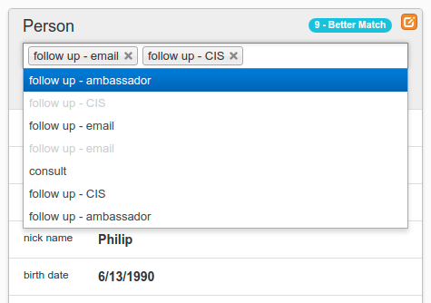

# Item Flags

## Introduction

**Item Flags** (also known as *item tags*) allow users to attach predefined flags to items within a master record. Any database table item may have flags defined for it.

*Item Flags* are typically used as a mechanism for marking specific participants for follow-up actions or categorizing them for simple searches. One of the benefits of this style of tagging is that the storage of *Item Flag* data is outside of the main data table, avoiding the need to edit data records just to change a flag. Also, unlike *Tracker* entries, flags may be removed as well as added.

Administration is provided in [Classification: Item Flag Names](/admin/item_flag_names)

## Adding an Entry

An *Item Flag* name is a single entry to appear as an option in an *Item Flags* field associated with a database table item.

Enter values in the following fields:

- **Name** - the text to appear in as an option (upper and lower case are allowed)
- **Item type** - the item type (data model) the flag is associated with

## Editing an Entry

An *Item Flag* entry may be edited to change the configuration set when it was created. The item type can not be changed. Although the *Name* can be changed, remember that any items already tagged with this item will show the new name, so the name should continue to represent the same meaning.

## Removing an Entry

To remove a choice from an *Item Flags* selection box, edit the item and set the **disable** flag.
