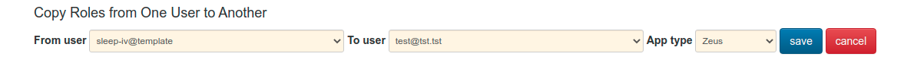

# Copying User Role Templates

A template user can be copied to a new user, assigning all the template user's roles (within the selected app) to the new user. The only requirement is that the target user does not already have any roles within this app.

The form **Copy Roles from One User to Another** appears near the top of the page.

Select the user to copy from (typically a user with **@template** username), the user to copy the roles to, and the app which the roles should be limited to.

After clicking **save**, a message will appear like

    test@tst.tst now has 3 roles for app zeus

If the user already had roles in the selected app, you'll receive a message

    Unexpected Error
    can not copy roles to a user with roles in this app zeus

If you receive the message

    test@tst.tst now has 0 roles for app zeus

the template user has no roles in the selected app. It is likely that either the app or the template user were selected incorrectly.
