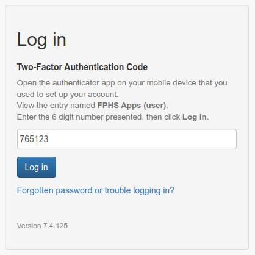

# Guest Help

## Welcome to {{environment_name}}

To get started, you will need to login.

From the home page a simple login form prompts you to login to the application. You will need to enter your username and password to continue{{#if mfa_disabled}}. {{else}}, then on the next page you will separately enter your two-factor authentication code **except for the [first time that you login](#first-login)**.{{/if}}

If you are having issues logging in, [check what to do next](login_issues.md). {{#if allow_users_to_register}}If you have been invited to register for a new account, the [registration](registration.md) page provides additional information.{{/if}}

 {{#if mfa_disabled}} {{else}}{{/if}}

**IMPORTANT:** if you see any other page than a study app page with your organizations's logo and a login form (for example, you see a browser warning) or anything else that you don’t expect, do not continue. Close your browser tab and report it to your app administrator ({{admin_email}}).

## First Login

The first time you login you should use the temporary password you were provided when your account was set up. Enter your username and temporary password, then click **Login**.

{{#if mfa_disabled}} {{else}}
If you have not already done so, install a two-factor authenticator app on your smartphone. After logging in with your temporary password you will be presented with a dialog that displays a QR code to set up your two-factor authenticator app. On your smartphone, open the authenticator app, then find the option to add a new account (often a **+** button or *Add Account* menu item.) If given the option, you will add the account using a QR code. Point the smartphone camera at the QR code on screen to scan the barcode and add the account.

---

### Two-Factor Authentication apps that are known to work well

- Duo Mobile
- Google Authenticator
- Microsoft Authenticator
- LastPass Authenticator
- Authy

These should be freely installable from your device’s app store

---

Once you have the new barcode added, the authenticator app should present a six digit number that updates every 30 seconds.

Enter this number (without the space) into the **Two-Factor Authentication Code** field and hit the **Submit Code** button. If the code is correct this will confirm that your app is set up correctly and can be used for future logins.
{{/if}}

Now you will need to change your temporary password. Enter the temporary password that you were provided into **Current password** and a new password into the **Enter new password** and **Password confirmation** fields, then click **Update**. If you use a password manager, save this new password now.

After this step you will be taken to the home page. Future logins will not require all these steps.

**NOTE:** It is highly recommended that you use a password manager to generate a new password. This will make it easier to generate a truly random password of sufficient complexity, and to store the password for future use.

## Future logins

To login to the app for all future logins, go to the login page as before. The page will prompt you for your email and password. Enter these fields then click **Log in**.
{{#if mfa_disabled}} {{else}}On the next page you will be prompted for your two-factor authentication code.

Open the authenticator app on your smartphone and find the appropriate login in the list. View the 6-digit code that is displayed. Enter the code into the Two-Factor Authentication Code field and click Log in.

{{/if}}

If all of the entered details are correct, you will be logged in successfully and can continue using the app. If any one of the details is incorrect, you will need to try again.

---

*Be aware that the two-factor authentication code is only valid for the time it is displayed on your smartphone app, plus up to another 30 seconds. If the time on your phone is incorrect then this extended period may be shorter, or may not work at all.*

---

---

*Only attempt to enter a two-factor authentication code once. The app prevents reuse of codes (even if a login failed), to avoid somebody looking over your shoulder from using a code you have used.*

---

## Logging in from bookmarks or notification emails

If you click a bookmarked search or report, or a link in an app notification email, you will be prompted to login if you do not already have an active session in your browser. After logging in you will be taken to the page you requested.

## Forgotten password or locked account

You have **{{password_max_attempts}} attempts** to login successfully, after which point your account will be locked for one hour *(dependent on server configuration)*. If you have forgotten your password, or need your account unlocked faster, contact the app administrator for a password reset.

## Lost two-factor authentication

If you uninstall the authenticator app on your smartphone or change your phone you will need to set up the authenticator app again (unless you have backed up the configuration). The app administrator can reset your code and you will need to go through the first time login process again.
