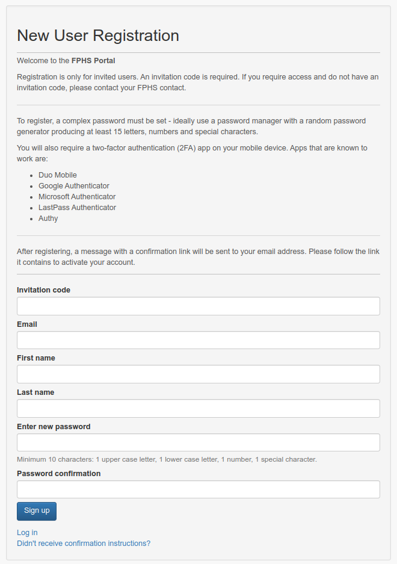
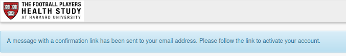
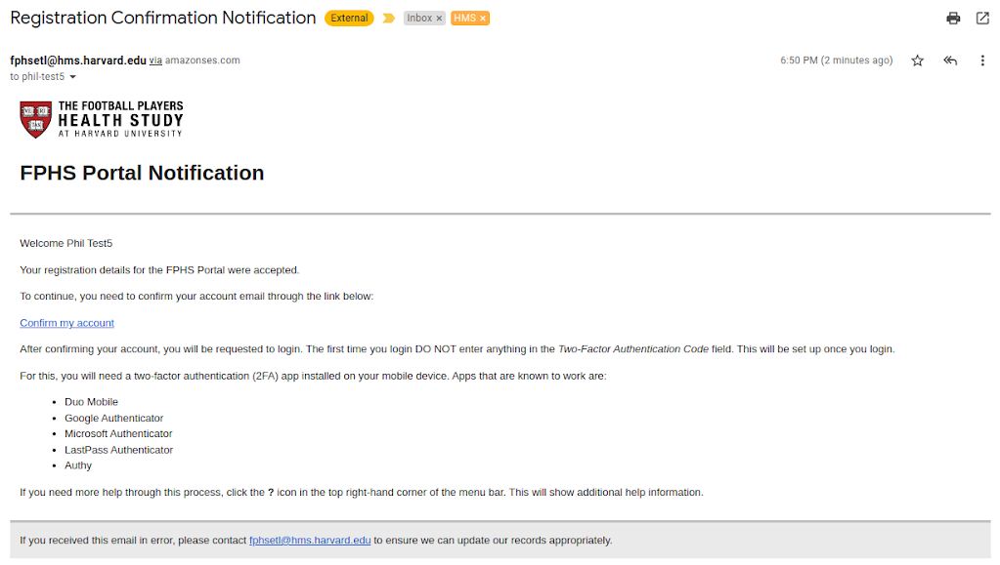

# Registration

New users self-register at: [{{base_url}}/users/sign_up]({{base_url}}/users/sign_up#open-in-new-tab)

You may have been provided an invitation code to enter into the the registration form. Alternatively, you may have been provided a specific link that includes this invitation code. If you do not have one of these, you will not be able to register - you should contact your administrator for more information.

Enter the information requested. Select a password that meets the required complexity, which you should then re-enter into the *Password confirmation* field.

When complete, click the **Sign up** button.

## Confirming Registration

Immediately after registration, you will be shown a message:

Check your email. The confirmation email provides useful information to help you as a new user get started:

Click the **Confirm my account** link to confirm the registration and login the first time.

## Logging in the first time

The first time you log in you’ll have a different process to follow.

[Follow the first login process](README.md#first-login)
