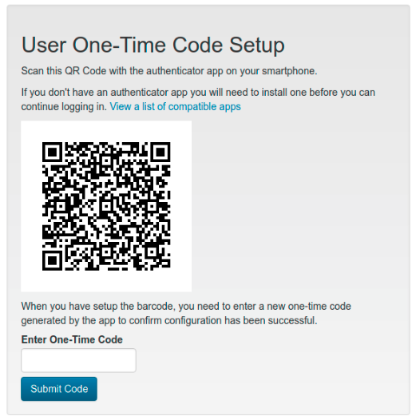
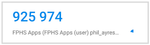

# Setting Up Two-Factor Authentication After an Upgrade

Your app administrator has enabled two-factor authentication (2FA) to improve
the security of your account. The next time you log in, you will need to set up
an authenticator app on your smartphone before you can access the application.

## What You Will Need

- Your existing email and password (these have not changed)
- A smartphone with an authenticator app installed

### Recommended Authenticator Apps

If you do not already have an authenticator app, install one of the following
from your device's app store before your next login:

- **Duo Mobile**
- **Google Authenticator**
- **Microsoft Authenticator**
- **LastPass Authenticator**
- **Authy**

## First Login After the Upgrade

1. Go to the login page and enter your **email** and **password** as usual,
   then click **Log in**

2. Instead of the usual home page, you will see a **Two-Factor Authentication
   Setup** page with a QR code

   

3. Open the authenticator app on your smartphone

4. Tap the option to **add a new account** (often a **+** button or **Add
   Account** menu item)

5. If given the option, choose to add the account using a **QR code**

6. Point your phone's camera at the QR code on screen to scan it — the app
   will create a new entry for this login

7. The authenticator app will now display a **6-digit code** that updates every
   30 seconds

   

8. Enter this 6-digit code (without spaces) into the **Enter Two-Factor
   Authentication Code** field on screen

9. Click **Submit Code**

If the code is correct, you will be taken to the home page. Your authenticator
app is now set up and ready for future logins.

> **Tip:** If the code is rejected, wait for the code on your authenticator app
> to change to a new number, then try again. The codes are time-sensitive and
> must be entered while they are still displayed.

## Future Logins

After completing setup, every login will require two steps:

1. Enter your **email** and **password**, then click **Log in**
2. On the next page, enter the current **6-digit code** from your authenticator
   app, then click **Log in**

If all details are correct, you will be signed in successfully.

## Troubleshooting

| Problem | What to do |
|---------|-----------|
| I don't see a QR code after logging in | Your account may already have 2FA set up. Enter the code from your existing authenticator app entry. |
| My code is always rejected | Make sure your phone's date and time are set automatically. The codes depend on your device clock being accurate. |
| I lost my phone or authenticator app | Contact your app administrator to reset your 2FA. You will be prompted to set up a new authenticator app entry on your next login. |
| I don't have a smartphone | Ask your administrator about desktop authenticator options such as Authy for desktop. |
