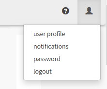

# Change Password

You will be prompted to change your password periodically to avoid your account being locked. If you believe that your account password has been revealed to another person, you should also change your password immediately, and inform the app administrator.

To change your password, simply click the user icon at the right-hand end of the top navigation bar to show the user options.

Click the **password** option to view the _change password_ form.

Enter your current password into **Current password** and a new password into the **Enter new password** and **Password confirmation** fields, then click **Update**. If you use a password manager, save this new password now.

**NOTE:** It is highly recommended that you use a password manager to generate a new password. This will make it easier to generate a truly random password of sufficient complexity, and to store the password for future use.
