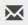

# Notifications

The application sends important notifications to users primarily by email, and for some apps as short SMS text messages.

Notifications generally have a common template and should be easy to recognize. They will be sent from the email
address: **notifications_from_email**

In most notification messages, a link will be provided to take you directly to the relevant page or record in the app. If
you are already logged in, the page will just open in a new tab. If you are not logged in to the app, the standard [login](login.md)
page will appear. After logging in you will be redirected to the intended page.

SMS messages, where used, are short messages, used for time-sensitive actions. They may provide a link to the appropriate page in the app,
or where used, a study ID number that can be used to search for the appropriate record on a computer.

## Opting Out of Email or SMS

All users may opt out from receiving email and / or SMS notifications. Contact the
app administrator [{{admin_email}}](mailto:{{admin_email}}) or other study representative to
opt out of one or other type of notification.

## Viewing Notifications in the App

You may also [view notifications](/reports/user__my_notifications) within the app.
Click the envelope icon  in the top navigation bar. If
the icon is not shown, it will appear in the user menu:

Opting out of email or SMS will not prevent notifications being shown in the app.
