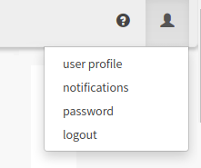
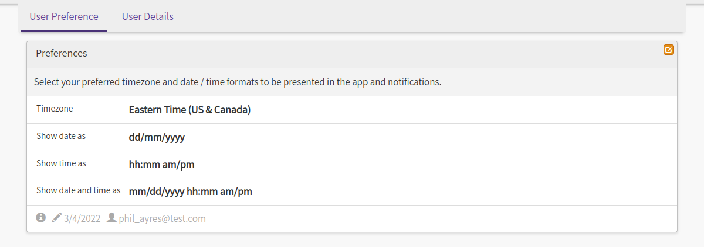
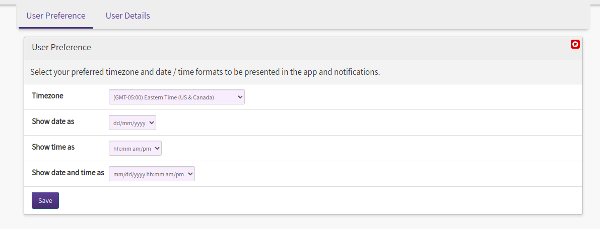
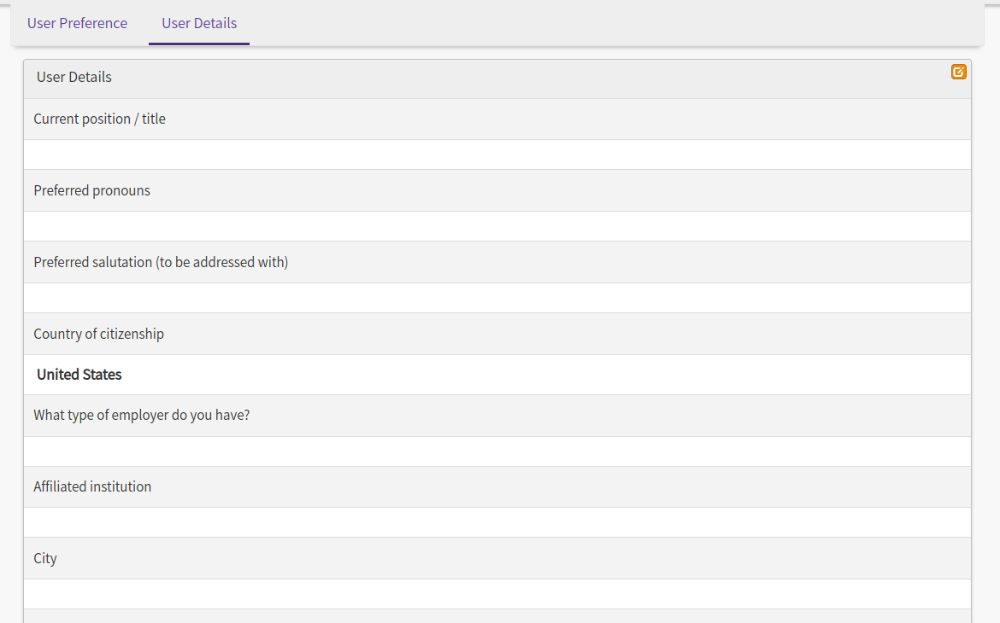

# Update User Profile

Your user profile allows you to manage information and preferences specific to your use of the portal. It may be accessed by clicking the user icon in the top navigation bar, then selecting **user profile** from the
drop down menu.

A page with a series of tabs will be displayed. The tabs that appear will be specific to the app you are
working in. By default there will always be a **User Preference** tab.

## Common User Preferences

The *User Preference* tab shows settings that are used to display information in a user's preferred format
throughout the portal. These are:

- **Timezone** - the timezone to display times in, where appropriate
- **Show date as** - the format for dates
- **Show time as** - the format for showing times
- **Show date and time as** - the format for showing dates and times together

To make a change, click the {{glyphicon_edit}} edit icon in the top right of the form.

Make your new selections then click **Save**, or to make no changes, click the {{glyphicon_remove_sign}} button to cancel.

## Other Profile Tabs

Depending on the app you are using, one or more additional tabs will be displayed. In these, you can view and edit the specific information requested. For example, additional user details may be required:

Since information within your profile is used across the application, you may find that some of the information in these forms is already populated based on activities you have performed previously. The *User Profile* link from the user menu gives you a way to easily access this information and keep it up to date.
